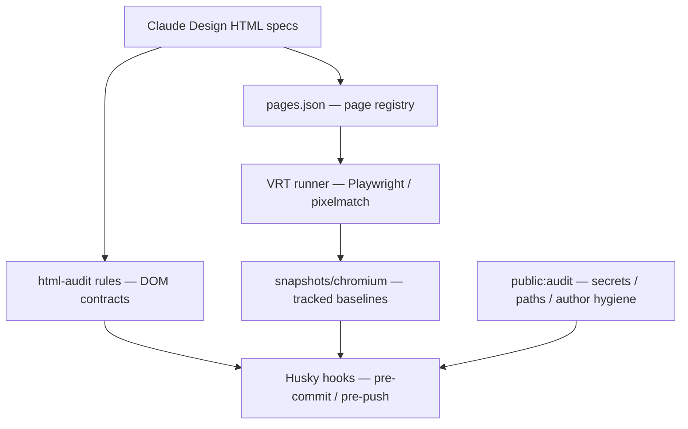

<!-- markdownlint-disable MD013 MD033 MD041 -->


# design-blueprint

Claude Design で作成した HTML デザイン仕様を、Codex で実装向けに調整・監査するための VRT 管理リポジトリです。

[](https://nodejs.org/)
[](https://playwright.dev/)
[](./LICENSE)

ポートフォリオリポジトリのため外部 PR、一般的なサポート依頼、機能要望、通常のバグ報告は受け付けません。Issue は依存更新や公開リポジトリ運用上の衛生報告のために限定的に有効化しています。

---

## DISCLAIMER

このリポジトリには、架空の医薬品・疾患リファレンスアプリ用のデザイン仕様が含まれます。仕様内の医薬品・疾患・臨床情報は架空のサンプルであり、医療判断・診断・処方・服薬判断その他のいかなる医療行為にも使用してはなりません。

This repository contains design specifications for a FICTIONAL drug and disease reference app. It is NOT medical advice and MUST NOT be used for diagnosis, treatment, prescribing, or any other medical decision.

---

## 主な特徴

- **HTML 仕様を SSOT として管理** — 各デザインは実装リポジトリ名と同じ top-level directory に置き、`pages.json` で VRT 対象を宣言します。
- **pre-commit / pre-push VRT** — staged project だけを commit 前に確認し、push 前には全 project の lint / HTML audit / VRT を実行します。
- **DOM ベースの HTML audit** — stale text、親子構造、TOC、画面契約を `scripts/html-audit-rules/*.json` で固定します。
- **Claude Design から Codex 実装へ橋渡し** — 見た目だけでなく、Flutter 実装・mock-server fixture・README 公開方針と照合した契約を仕様に残します。
- **公開前 audit を同梱** — tracked tree と Git history に秘密情報、ローカル絶対パス、個人メールが混入しないことを `npm run public:audit` で確認します。

---

## 動かす

```bash
# 依存解決
npm ci

# Chromium をインストール
npx playwright install chromium

# HTML audit / lint / VRT
npm run html:audit:selftest
npm run html:audit
npm run lint
npm run vrt
```

`package.json` の `prepare` script は Husky hook を設定します。`npm install` または `npm ci` を実行していない clone では、commit / push 時の VRT が有効になりません。

---

## 収録プロジェクト

| Project | 内容 |
| --- | --- |
| `fictional-drug-and-disease-ref-flutter/` | 架空医薬品・疾患リファレンスアプリの検索、詳細、ブックマーク、閲覧履歴、計算ツール、Design System |
| `resume-flutter/` | Flutter Web 履歴書の Hero、職務経歴、個人開発、その他活動、スキル、Design System |
| `fictional-drug-and-disease-ref-sample/` | VRT と audit の最小サンプル |

各 project は `pages.json` を持つ directory として検出されます。HTML と snapshot PNG は同じ project directory に閉じ、baseline 更新は `npm run vrt:approve` 経由で行います。

---

## アーキテクチャ

HTML 仕様、DOM audit、VRT baseline、Git hook を分離しています。画面固有の契約は HTML 本文と audit rule に置き、共通 runner は project / page を `pages.json` から読み込みます。



---

## 開発

```bash
# 全 HTML を整形チェック
npm run lint

# HTML 仕様の構造監査
npm run html:audit

# VRT
npm run vrt

# VRT 差分を baseline として承認
npm run vrt:approve -- --project <project> --page <page>

# 公開前監査
npm run public:audit
```

### HTML 仕様の編集

1. 対象 project の `pages.json` を確認します。
2. 変更する HTML を読み、画面状態・操作状態・responsive contract を把握します。
3. 大きい仕様修正や再発防止が必要な修正では、`scripts/html-audit-rules/*.json` に契約を追加します。
4. VRT 失敗時は `.vrt-output/report/results.json` の `compare_file_path`、`golden_file_path`、`actual_file_path`、`page_file` を確認します。

### CI

Pull Request では `CI / ci-gate` が trust gate として動作します。外部 fork からの Pull Request は受け付けず、同一 repository からの owner / dependency bot PR だけを検証対象にします。

GitHub Actions は selected actions と SHA pinning を前提にしています。workflow の `uses:` を更新する場合は、許可リスト側も同じ commit SHA に合わせて更新してください。

---

## リポジトリ運用

- 依存関係更新の Pull Request は Renovate が管理します。
- GitHub Actions と workflow 依存関係の更新は SHA pinning と selected actions を維持したまま手動レビューで適用します。
- 外部からの Pull Request はレビュー対象外です。
- 一般的なサポート・機能要望・バグ報告は GitHub Issues では受け付けていません。
- 公開 Issue は repository hygiene report のみに限定し、秘密情報・個人情報・脆弱性詳細を投稿しない導線にしています。
- セキュリティ報告は [SECURITY.md](./SECURITY.md) の手順に従ってください。

---

## セキュリティ / 公開前確認

- GitHub 履歴の author email は GitHub noreply に統一しています。
- tracked tree、Git 履歴、GitHub Issue / Pull Request / コメント / Actions log に対して、秘密情報・ローカル絶対パス・個人メールの混入を確認します。
- README 用画像は表示に必要な画像データを残し、不要な PNG メタデータを除去します。
- design HTML には外部 CDN scripts を追加しません。既存の外部 font link は audit rule で管理し、VRT の安定性を優先して self-host / inline 化を進めます。
- 公開後は GitHub secret scanning / push protection / Dependabot security updates の有効化状態を確認します。

---

## ライセンス

本プロジェクトは [MIT License](./LICENSE) で公開しています。

### サードパーティソフトウェア

| ライブラリ / アセット | ライセンス | 用途 |
| --- | --- | --- |
| [Playwright](https://playwright.dev/) | Apache-2.0 | Chromium capture / VRT 実行 |
| [pixelmatch](https://github.com/mapbox/pixelmatch) | ISC | PNG 差分比較 |
| [pngjs](https://github.com/pngjs/pngjs) | MIT | PNG 読み書き |
| [sharp](https://sharp.pixelplumbing.com/) | Apache-2.0 | VRT comparison image composition |
| [htmlhint](https://htmlhint.com/) | MIT | HTML lint |
| [Prettier](https://prettier.io/) | MIT | HTML formatting check |
| [Noto Sans JP](https://fonts.google.com/noto/specimen/Noto+Sans+JP) | SIL OFL 1.1 | Design System preview fonts |
